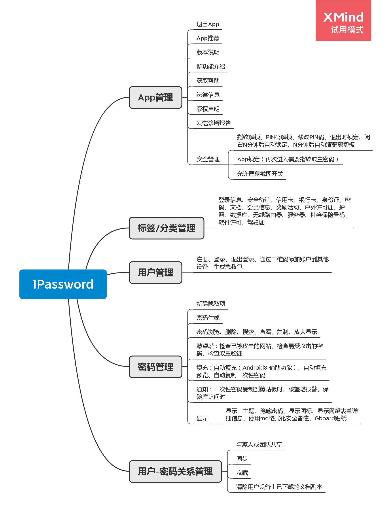
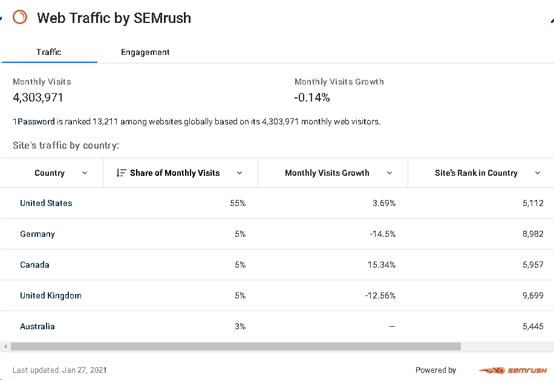
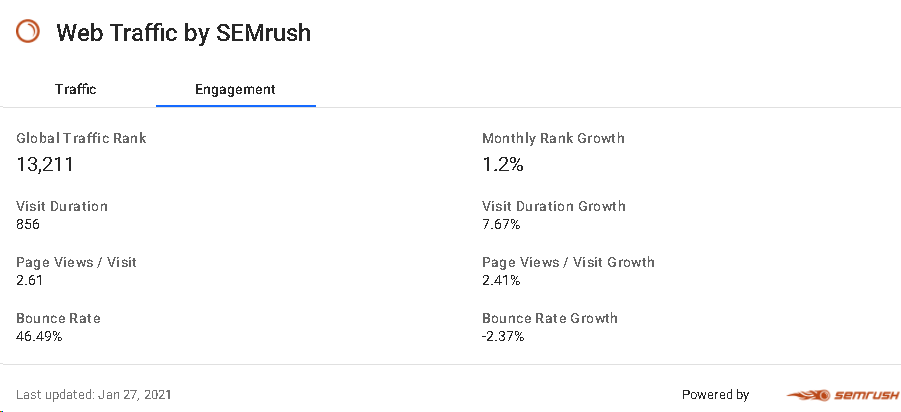
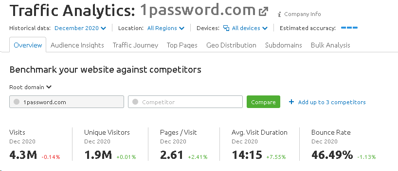
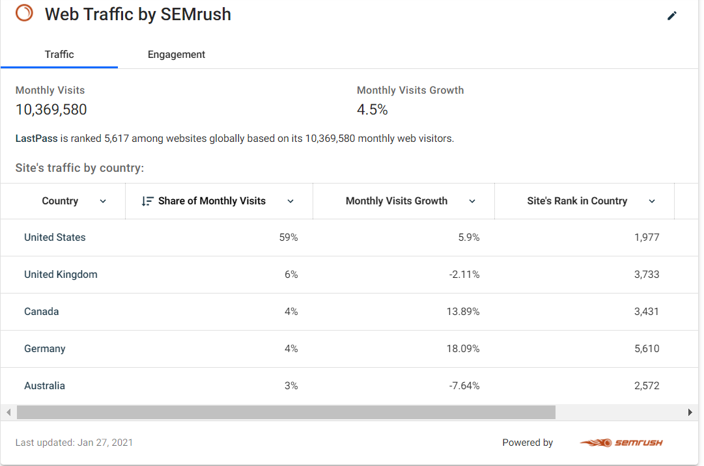
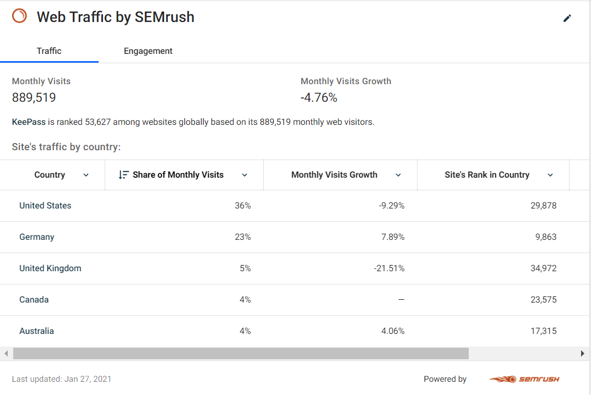
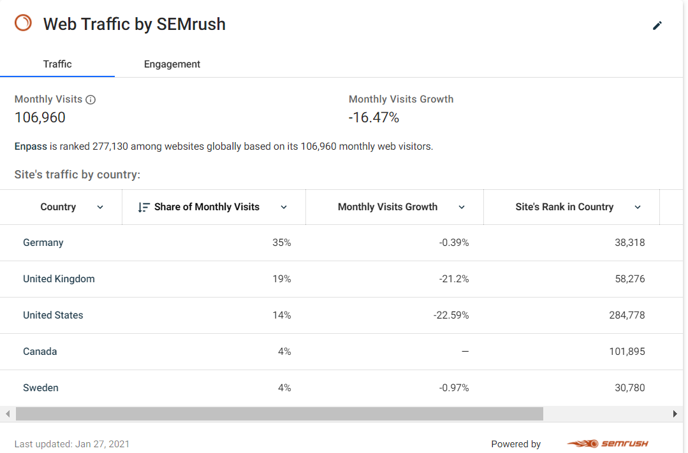
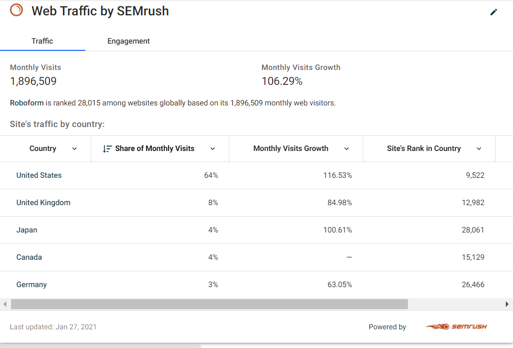
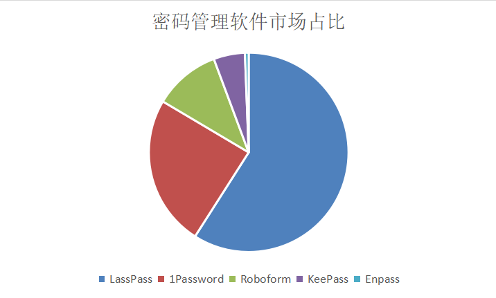

# 1Password产品分析报告

## 修订记录

| 日期       | 修订版本 | 修订描述                           | 修订人 |
| ---------- | -------- | ---------------------------------- | ------ |
| 2021-01-05 | v0.5     | 创建                               | wanhex |
| 2021-01-10 | v0.5.5   | 增加目的和产品描述                 | wanhex |
| 2021-02-02 | v0.5.8   | 增加产品逻辑描述                   | wanhex |
| 2021-02-02 | v0.6.0   | 增加功能列表思维导图               | wanhex |
| 2021-02-05 | v0.6.3   | 增加产品运营数据，以及对数据的解读 | wanhex |
| 2021-02-06 | v0.6.6   | 增加竞品运营数据，以及对比分析     | wanhex |

## 目的

要做一个类似1Password的App（安心密码）。

通过对1Password产品的完整分析，找到突破口。

## 产品描述

1Password是一款安全的密码管理器。

1Password 不仅仅能管理密码，它还可以管理您的财务信息、个人证件，或任何需要保持安全且便于访问的信息。

## 功能分析

### 产品逻辑

**以下内容来自1password官网：**

The world’s most-loved password manager

**PasswordManager**、**1Password Watchtower**、**Digital Wallet**、**Unrivaled support**、**Travel Mode**、**Advanced Encryption**、**Total privacy**

**PasswordManager**：1Password is the easiest way to store and use strong passwords. Log in to sites and fill forms securely with a single click.

**1Password Watchtower**：Receive alerts for compromised websites and vulnerable passwords so you can take action to stay secure.

**Digital Wallet**：Securely store credit and debit cards, online banking information, and PayPal logins so you can fill them from any device.

**Unrivaled support**：Whenever you need it, our global team is here to help. Get free, one-on-one support from the 1Password team.

**Travel Mode**：Remove sensitive data from your devices when you cross borders, and restore access with a click when you arrive.

**Advanced Encryption**：Our security recipe starts with AES-256 bit encryption and uses multiple techniques to protect your data at rest and in transit.

**Total privacy**：Only you can access your data. We don’t use it, we don’t share it, and we don’t sell it. You’re our customer, not our product.

 **以下内容来自GooglePlay 1Password主页：**

 **安全存放密码**

1Password 为您记住您的所有密码，并将它们保存在安全的地方，用一个只有你知道的密码保护它们。

◆ 为您的所有在线账号创建强壮且唯一的密码
◆ 将用户名和密码自动填入网站和应用
◆ 随意在您的移动设备和计算机上存取您的信息
◆ 与您的家人或公司安全地分享密码
◆ 解锁只需一触——指纹解锁

**安全存放隐私信息**

1Password 不仅仅能存密码：它还可以存放您的财务信息、个人证件，或任何您需要在其中存放的需保持安全和便于访问的信息。

◆ 存储信息的类别多达几十种：登录信息、信用卡、地址、笔记、银行账号、驾驶执照、护照等等。
◆ 可以创建多个存储库，将生活中的不同领域分隔开来
◆ 可用收藏夹管理您的信息
◆ 可使用搜索来查找和筛选您的信息

**保持安全**

您在 1Password 中存储的所有数据都以一个主密码保护，而主密码只有您知道。 1Password 使用端到端加密，因此只会在本地解密您的数据。 加密密钥永远不会离开您的设备，因此只有您可以接触到您的密码。

◆ 使用指纹解锁可快速、安全地解锁本应用
◆ 自动锁定本应用，确保您的数据不受侵害，即使您的设备遗失或被盗

**与团队和家庭共享**

1Password for Android 已完全支持团队和家庭帐户。 与您共同工作的同事、或共同生活的家人，共享 1Password 的安全方便性，从未如此简单

◆新增您的所有帐户—家庭、团队、个人—然后在同个地方看到您所有信息
◆ 轻松地迁移帐户之间的信息
◆ 与更多的队友与家庭成员共享密码  

**总结如下：**

| 层次           | 不同层次的产品逻辑描述                                       |
| -------------- | ------------------------------------------------------------ |
| 信息层和表面层 | 见下述功能列表                                               |
| 结构层         | 暂略                                                         |
| 范围层         | 密码管理、网站密码泄露提醒、隐私数据管理、数字钱包、高级数据加密、技术支持、旅行模式、与团队和家庭共享 |
| 战略层         | The world’s most-loved password manager                      |

### 功能列表

## 产品运营状况

### 当前运营数据

价格：

- 个人版：$2.99/月

- 家庭版：$4.99/月

- 团队/企业版：$3.99-US$59.99/月

GooglePlay数据：

- App安装次数：1,000,000+（免费下载安装、App内付费）
- Google Play评论次数：31,174+

官网数据：

- 个人版：Trusted by over 15 million users

- 家庭版：Loved and used by millions.

- 企业版：More than 70,000 businesses trust 1Password to secure their business and protect their data.  

以下内容来源于1Password公开博客：

1Password于2005年在多伦多成立，1Password最初只是针对消费者，截止2019年， 14 years里，1Password一直在保持增长。

Shiner于2011年成为了1Password的首席执行官，根据他之前的B2B背景，开始着手进军B2B。

2016年5月，1Password开始向企业提供服务，截止到Nov 14, 2019，大约有5万客户在使用企业服务Enterprise Password Manager，2016~2019，企业用户增长300%。

因此推断，在2011年以前，1Password在消费市场可能持续增长了6年。在遇到增长瓶颈时（2011年左右），着手进军企业市场。

企业市场方面，2011~2016是企业市场冷启动阶段，2016~2019末企业用户增长300%，2019年约有5万企业用户。而根据官网数据，截止到2021年初，企业市场约有7万用户，从2019末~2021初企业用户增长40%（数据表现很棒）

数据来源：

https://blog.1password.com/accel-partnership/

https://www.lieyunwang.com/archives/460750

其他增长相关数据：

如图，1Password主要增长来源在美国和加拿大，美国的访问量增加可能与企业服务有关。如果将美国和加拿大的增长模式复制到其他国家，数据可能还会迎来大规模增长。

数据来源：https://www.crunchbase.com/organization/1password/technology

如图，1Password的PV数较同期增长了2.41%，用户时长增幅较大。

数据来源：https://www.crunchbase.com/organization/1password/technology

如图，1Password的UV增长缓慢，但用户时长增幅较大。

该数据来源：https://www.semrush.com/analytics/traffic/overview/1password.com?searchType=domain

综上：

当前1Password正积极发力企业市场，由于之前的消费用户基数过高，几万数量企业用户带来的UV增长不是很明显，但由于企业用户的特殊性（频繁使用1Password），会导致1Password的用户时长大幅增加。而大年的企业市场主要增长来源可能主要分布在加拿大和美国。一旦时机成熟，将成功模式复制到其他国家会迎来大规模增长。

### 竞品运营数据

竞品包括：LastPass、KeePass、Enpass、EasyPass、RoboForm、钥匙串。

LastPass数据：

KeePass：

Enpass：

Roboform：

从MAU数据看，密码管理软件市场主要玩家是LassPass、1Password、Roboform、KeePass，市场占比如下：

### 产品用户描述

#### 用户画像

#### 用户需求

#### 用户价值

### 商业模式

## 历史发展路径

### 功能迭代情况

### 关键发展事件

### 关键历史阶段

https://www.xianjichina.com/special/detail_431676.html

https://www.lieyunwang.com/archives/460750

2019-11，获2亿美元投资，A轮融资，领投方为Accel。

https://robo.datayes.com/v2/details/report/4016892?tab=original

2019-11，估值：65 亿人民币。

## 结论

